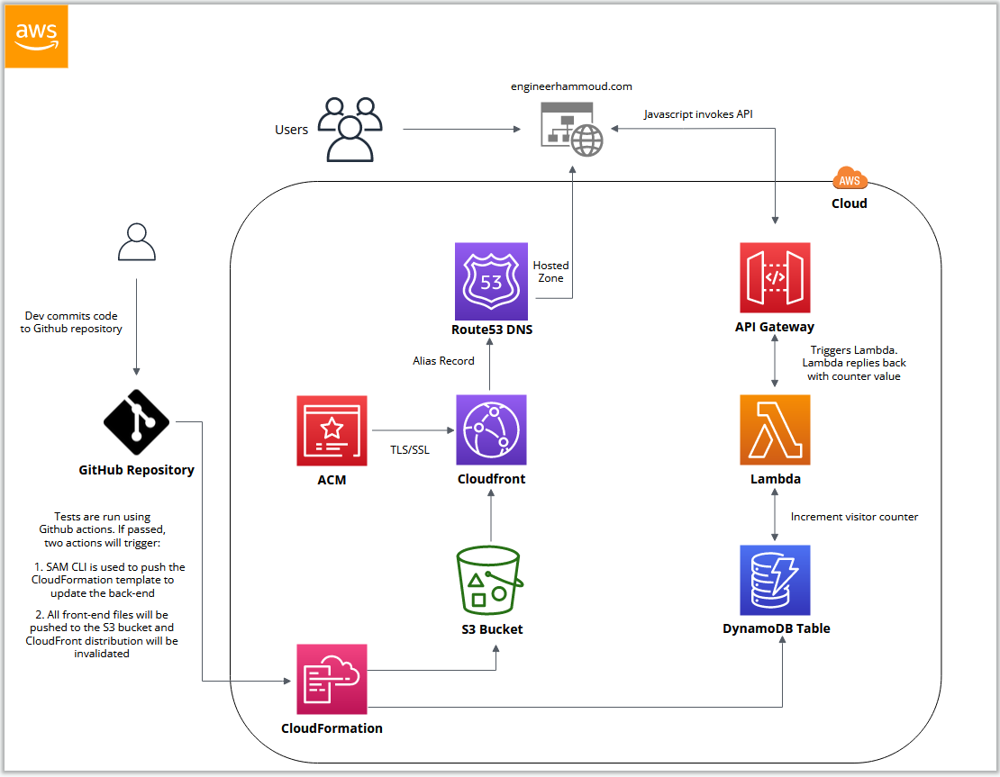

#The Cloud Resume Challenge

I graduated as a Computer Engineer and have many years of experience working in the field, mostly doing System Administration and Networking tasks, and playing with HTML/CSS in my free time. The thing about the Computer Science field is that it keeps evolving and expanding very quickly. One of the areas that caught my attention was Cloud computing, and how entire infrastructures could be built and maintined in the Cloud.

I decided to start reading more and more about Cloud and get some certifications with the goal of understanding better how the major cloud providers operate, all the different services each one of them offer and how to use this knowledge not only to build the infrastructure according to the needs of the customer, but also learning how to operate, troubleshoot and train customers on best practices. After studying and obtaining a few certificates, I discovered [The Cloud Resume Challenge](https://cloudresumechallenge.dev/docs/the-challenge/), and immediately decided to take the challenge to keep building my skills and knowledge.

The main idea of [Forrest Brazeal's](https://forrestbrazeal.com) challenge is to be able to build the infrastructure to maintain a website with our resume. There will be a front-end, there will be a back-end, there's some coding, and many services being used in conjunction. The challenge can be taken using one of the following cloud providers: AWS, Azure and GCP. I have personally decided to build my infrastructure using AWS, since I've already been certified twice with AWS and had spent a lof of time studying and getting familiar with the AWS platform.

This is a drawing of what the final product looks like:

And you can find the final result at https://engineerhammoud.com

Below I will list all the steps required to complete the challenge, as well as a brief summary of the things I did to complete each step.

##Step 1: Certification

The first step to complete the Cloud Resume Challenge is to obtain a Cloud certification. This is mostly for those who are just starting in the Cloud field with no previous experience or knowledge. In my case, I have obtained already a couple of certifications from Amazon Web Services: **AWS Certified Solutions Architect Associate** & **AWS Certified SysOps Administrator Associate**. Having these certifications helped me big time understanding all the services that I needed to use to complete the challenge. 

##Steps 2, 3, 4, 5 and 6: HTML/CSS, S3 bucket, HTTPS, DNS.

All these steps together helped me build the front-end. I didn't want to spend too much time building the HTML/CSS part, so I downloaded a free template from [Tutorialzine](https://tutorialzine.com), which I then modified and adapted to my needs: changed colors, created new sections, added icons and also added some extra Javascript for the website navigation. Once I had the site finished, I had to create an **S3 bucket**, upload the site files to the bucket and modify the settings of the S3 bucket to make it a ***static website***.

Next, I needed to make the website secure. By default, S3 serves the content of the static website as **HTTP** which is unsecure. To make it secure, I had to create a *CloudFront* distribution using the S3 bucket as origin. I also had to buy a domain for my site which I did using *Amazon Route 53*, and then created an SSL certificate for the domain, using Amazon Certificate Manager. Finally I needed to create an alias target on Route 53 pointing to my CloudFront distribution.

Once all these steps were completed, I was able to access my site using the domain that I bought with a secure connection (**HTTPS**).

  
##Steps 7, 8, 9, 10: Javascript, Database, API, Python.

At this point in the challenge, I was already building the back-end of the site. The first thing that we are tasked with is to build the database for the counter. I have created a *DynamoDB* table to store the value of each visit to my site, which can then be fetched and shown on the site itself. But we are asked that the site counter should not communicate with the database directly. Instead, we need to create an API that will be a *middle man*, accepting requests from the web app and then communicating with the database. 

To achieve this, I had to use *AWS API Gateway* and *Lambda*. I created a Lambda function using some Python code. The Python code uses boto3 library for AWS. It connects to the database, retrieves the value of the table and adds a +1. This happens whenever the API Gateway receives a request (from the Javascript counter), which then triggers the Lambda function. 

To complete these steps, I created a counter using *Javascript* that will fetch the number of site visits stored in the DynamoDB table, and show this information in my resume webpage.

##Step 11: Tests

I created a simple test that checks my Python code. This will be used alongside *GitHub actions* whenever I **push** content to my repository.

##Step 12: Infrastructure as Code

One of the main goals of the challenge is to learn how to deploy an entire infrastructure using code. This is known as **IaC** or *Infrastructure as Code*. Although this entire challenge can be completed using AWS console (graphical interface), it is more practical to write the entire deployment in a document (using JSON or YAML). By having everything in code, not only it is way faster to deploy all required services, but it is also much easier to make changes or additions to the services being used.

For the challenge, I used a combination of the *AWS CLI* and *AWS SAM CLI*. At the end I decided to stick with AWS SAM CLI for ease of use and because it works perfect with serverless applications like Lambda and API Gateway.

##Steps 13, 14 and 15: Source Control,  CI/CD (Back end), CI/CD (Front end).

I created a *GitHub repository* for the Cloud Resume Challenge, and uploaded all the front-end and back-end files. I then set up GitHub actions, which allows to perform actions based on conditions (like a push request). Inside the YAML document used with GitHub actions, I created the following 3 actions that should be triggered whenever there's a push to the repository:

1. Test the Lambda code
2. Re-deploy the infrastructure if there are any changes
3. Push all the front-end files to the S3 bucket that hosting the static website and invalidate the CloudFront distribution. 

**Important note**: **DO NOT** commit AWS credentials to source control! Bad hats will find them and use them against you! GitHub secrets is your friend!!

 
##Final step 16: Create a blog post

It took me approximately a month to complete the challenge. It wasn't easy. I was not able to complete any of the steps mentioned above on the first try. I ran into many issues related to permissions, sometimes the problem was related to a mistake in the Cloudformation template (used by SAM CLI). The counter for the site didn't work out of the gate and I had to do a lot of troubleshooting on the Lambda fuction + API. Basically, every single step was a true challenge and required hours of troubleshooting and reading for me to be able to resolve them. I mention this, because **I strongly believe** that this is how we truly learn. We learn from mistakes, we learn from struggle and from challenges. 

I enjoyed every second I spent doing the Cloud Resume Challenge. I learned a lot about all the services that I worked with. I learned what to do and what NOT to do, while configuring these services, and now I know where to look at if I need to troubleshoot any issues related to these services.

This was a great way to learn and implement **IaC**. Looking forward to the next challenge!

